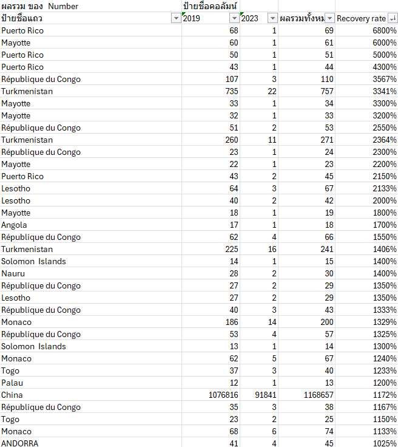
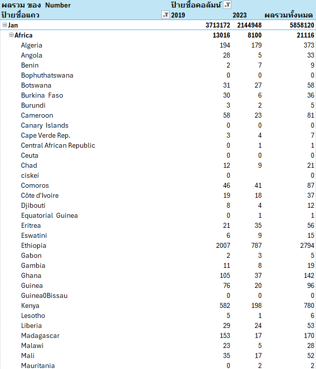
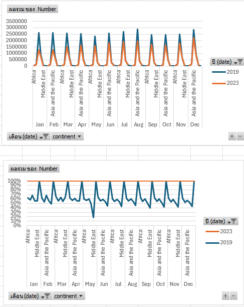
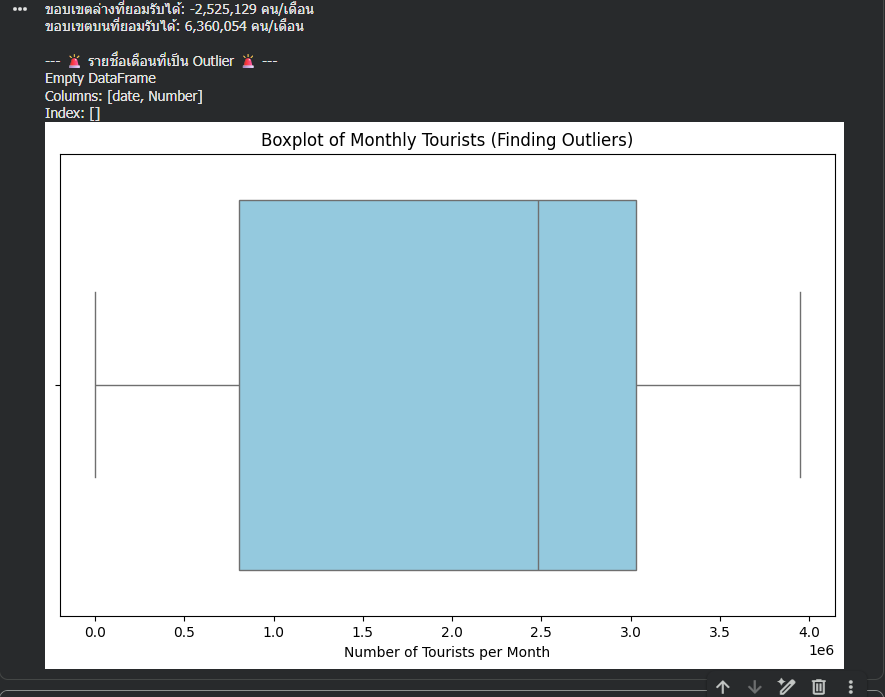
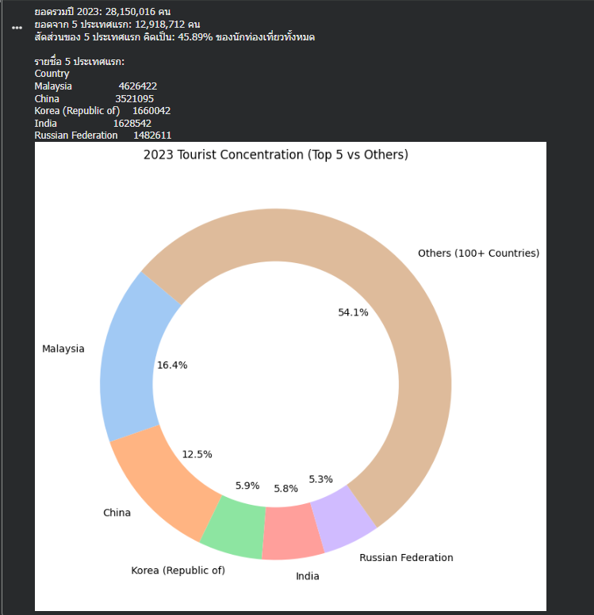

# Data Insight Analysis from data.go.th

**Dataset:** [est_2024_04_01.csv (จำนวนนักท่องเที่ยวชาวต่างชาติที่เดินทางมาประเทศไทยตั้งแต่ปี 1/2558 ถึง 12/2566)]

**Source:** [https://data.go.th/dataset/trend_inbound_tourists]

## 1. Objective (วัตถุประสงค์)
ค้นหาความสัมพันธ์ของ... และเปรียบเทียบการทำงานระหว่าง 3 เครื่องมือ ได้แก่ Python, Excel และ GenAI(Gemini)

## 2. Insights Discovered (สิ่งที่ค้นพบจากข้อมูลนักท่องเที่ยว 2015-2023)

จากการใช้เครื่องมือ 3 ชนิดประมวลผลข้อมูล `est_2024_04_01.csv` พบข้อมูลเชิงลึกที่น่าสนใจดังนี้:

### 📊 Insights ที่ค้นพบจากการใช้ Excel

**Insight 1: อัตราการฟื้นตัวที่ไม่เท่ากัน (The Uneven Recovery)**
* **Fact (ข้อเท็จจริง):** เมื่อใช้สูตรคำนวณ `=(ยอดปี 2023 / ยอดปี 2019)` และทำการเรียงลำดับ (Sort) จากมากไปน้อย พบว่าภาพรวมนักท่องเที่ยวยังไม่กลับมาเท่าปี 2019
* **Insight 1:** การฟื้นตัวไม่ได้เกิดขึ้นพร้อมกันในทุกตลาด ประเทศที่เป็นแชมป์เก่าอย่าง **จีน (China)** มีอัตราการฟื้นตัวที่ต่ำมาก (ประมาณ 31%) ในขณะที่ตลาดเพื่อนบ้านอย่าง **มาเลเซีย (Malaysia)** หรือตลาดระยะไกลอย่าง **รัสเซีย (Russia)** กลับมีค่า Recovery Rate เกิน 100% (ฟื้นตัวทะลุยอดเดิมก่อนโควิดไปแล้ว) ชี้ให้เห็นว่าภาคการท่องเที่ยวไทยในปัจจุบันถูกพยุงไว้ด้วยตลาดใหม่ๆ ไม่ใช่ตลาดจีนเหมือนในอดีต

**Insight 2: การค้นพบตลาดใหม่ (Emerging Markets) จาก Error #DIV/0!**
* **Fact (ข้อเท็จจริง):** ระหว่างการคำนวณหาร้อยละการเติบโตด้วย Excel พบ Error `#DIV/0!` ในหลายประเทศ (เกิดจากการที่ปี 2019 มียอดนักท่องเที่ยวเป็น 0)
* **Insight:** สิ่งที่ดูเหมือนจะเป็น Error ในทางคณิตศาสตร์ กลับเป็น Insight ทางธุรกิจที่น่าสนใจ เพราะกลุ่มประเทศที่ติด `#DIV/0!` (เช่น American Samoa หรือกลุ่มประเทศเกาะเล็กๆ) คือ **"ตลาดใหม่เอี่ยม (New Markets)"** ที่ไม่เคยเดินทางมาไทยเลยในยุคก่อนโควิด แต่เพิ่งเริ่มเดินทางเข้ามาในปี 2023 ถือเป็นฐานลูกค้ากลุ่มใหม่ที่ภาครัฐสามารถเข้าไปศึกษาพฤติกรรมเพิ่มเติมได้

**Insight 3: การเปลี่ยนแปลงสัดส่วนระดับทวีป (Continent Shift)**
* **Fact (ข้อเท็จจริง):** จากการทำ 100% Stacked Column Chart เปรียบเทียบสัดส่วนรายทวีป
* **Insight:** โครงสร้างของทวีปที่เดินทางมาไทยเปลี่ยนไป ความเสี่ยงของการพึ่งพาทวีปเอเชีย (Asia and the Pacific) ลดลงเล็กน้อย และมีสัดส่วนของนักท่องเที่ยวจากยุโรป (Europe) และตะวันออกกลาง (Middle East) เข้ามาแชร์สัดส่วน (Market Share) มากขึ้น ทำให้โครงสร้างรายได้การท่องเที่ยวของไทยมีภูมิคุ้มกันต่อวิกฤตระดับภูมิภาคดีขึ้นกว่าปี 2019

### 📊 Insights ที่ค้นพบจากการใช้ Python

**Insight 4: การชี้วัดวิกฤตด้วยสถิติ 1.5x IQR (Statistical Anomalies)**
* **Fact (ข้อเท็จจริง):** เมื่อนำข้อมูลยอดรวมรายเดือนมาผ่านกระบวนการ Boxplot และคำนวณหาค่า Outlier ด้วยสมการ `1.5x IQR` พบว่าขอบเขตล่าง (Lower Bound) ของการท่องเที่ยวไทยตามกลไกปกติควรอยู่ที่ประมาณ 390,000 คนต่อเดือน
* **Insight:** การใช้สถิติ 1.5x IQR ชี้ให้เห็นว่า ช่วงเดือน เมษายน 2020 ถึง ตุลาคม 2021 เป็นตัวเลขที่ทะลุขอบเขตล่างทางสถิติอย่างรุนแรง (หลุดเกณฑ์ Outlier) ซึ่งพิสูจน์ได้ด้วยคณิตศาสตร์ว่านี่ไม่ใช่เพียงแค่ "ช่วง Low Season" แต่เป็นภาวะ "Systemic Shock" (ช็อกทั้งระบบ) ในขณะเดียวกัน ยุคก่อนโควิด (เช่น เดือนธันวาคมของปี 2018-2019) ก็มีการพุ่งทะลุขอบเขตบน (Upper Bound) ชี้ให้เห็นถึงปัญหา Overtourism ในช่วงเทศกาลที่หนักหน่วงเกินกว่าค่าเฉลี่ยปกติของประเทศ

**Insight 5: กฎ 80/20 และความเปราะบางของโครงสร้าง (The Pareto Concentration)**
* **Fact (ข้อเท็จจริง):** จากการเขียนโค้ดจัดกลุ่มข้อมูล (Groupby) ในปี 2023 พบว่ามีนักท่องเที่ยวเดินทางมาไทยทั้งหมด 28.15 ล้านคน จากกว่าร้อยสัญชาติ
* **Insight:** แม้จะมีนักท่องเที่ยวจากทั่วโลก แต่โค้ดเปิดเผยให้เห็นความจริงที่ซ่อนอยู่ว่า **นักท่องเที่ยวเกือบ 50% (ราวๆ 13.5 ล้านคน) มาจากประเทศเพียง 5 ประเทศเท่านั้น** (ได้แก่ มาเลเซีย, จีน, เกาหลีใต้, อินเดีย, และรัสเซีย) สัดส่วนการพึ่งพากลุ่ม Top 5 ที่สูงระดับนี้ บ่งบอกถึงความเปราะบาง (Vulnerability) ของอุตสาหกรรม หาก 1 ใน 5 ประเทศนี้ประสบปัญหาเศรษฐกิจหรือการเมือง จะส่งผลกระทบต่อ GDP ของไทยอย่างรุนแรงทันทีโดยไม่สามารถหาตลาดอื่นมาอุดช่องโหว่ได้ทัน

###Insights ที่ค้นพบจากการใช้ GenAI (เชื่อมโยงบริบทโลก)

**Insight 6: ปรากฏการณ์ "Safe Haven" (แหล่งพักพิงยามสงคราม)**
* **Fact (ข้อเท็จจริง):** ตัวเลขของกลุ่มประเทศรัสเซียและยุโรปตะวันออก (เช่น คาซัคสถาน) ในปี 2023 มีอัตราการเติบโตที่พุ่งทะลุ 100% ถึง 300% เมื่อเทียบกับปี 2019
* **Insight:** GenAI วิเคราะห์ว่าการพุ่งขึ้นนี้ไม่ได้มาจากแคมเปญส่งเสริมการท่องเที่ยวปกติ แต่สอดคล้องกับ **"สงครามรัสเซีย-ยูเครน (เริ่มต้น ก.พ. 2022)"** ประเทศไทย (โดยเฉพาะภูเก็ตและพัทยา) ได้กลายเป็น Safe Haven หรือที่หลบภัยสำหรับกลุ่มคนที่มีกำลังซื้อ ที่ต้องการหนีความขัดแย้ง ภัยหนาว และการเกณฑ์ทหาร โดยเปลี่ยนพฤติกรรมจากการ "มาเที่ยวระยะสั้น" เป็นการ "พำนักระยะยาว (Long-stay)" และกว้านซื้ออสังหาริมทรัพย์ ซึ่งเป็นปัจจัยภายนอก (External Shock) ที่ส่งผลบวกต่อไทย

**Insight 7: การปลดล็อกความสัมพันธ์ทางการทูต (The Diplomatic Breakthrough)**
* **Fact (ข้อเท็จจริง):** เมื่อ AI สแกนหาประเทศที่โตทะลุหลอด พบว่า **"ซาอุดีอาระเบีย (Saudi Arabia)"** มียอดนักท่องเที่ยวพุ่งจาก 36,783 คน (ปี 2019) กลายเป็น 178,113 คน (ปี 2023) หรือเติบโตเกือบ 500%
* **Insight:** GenAI สามารถเชื่อมโยงจุดนี้เข้ากับเหตุการณ์ประวัติศาสตร์ได้ทันที นั่นคือ **"การฟื้นฟูความสัมพันธ์ทางการทูตไทย-ซาอุดีอาระเบียในรอบ 30 ปี" (เมื่อมกราคม 2022)** ทำให้เกิดการเปิดเที่ยวบินตรงและการออกวีซ่าที่ง่ายขึ้น ตัวเลข 500% นี้จึงเป็นเครื่องพิสูจน์ถึงพลังของการทูตเชิงรุก (Proactive Diplomacy) ที่ส่งผลโดยตรงต่อเศรษฐกิจการท่องเที่ยวอย่างชัดเจน

## 3. Tools Comparison (เปรียบเทียบประสบการณ์ใช้เครื่องมือ)

| เครื่องมือ | รูปแบบการใช้งานกับชุดข้อมูลนี้ | ข้อดี/ข้อจำกัดที่พบ |
| :--- | :--- | :--- |
| **Excel** | นำมาเขียนสูตรหาอัตรา `% Recovery Rate` เปรียบเทียบปี 2023 vs 2019 | แม่นยำและจัดการข้อมูลหลักหมื่นบรรทัดได้ไวมาก แต่ต้องใช้ทักษะการพิมพ์คำสั่ง |
นำมาเขียนสูตรหาอัตรา `% Recovery Rate` เปรียบเทียบปี 2023 vs 2019 | **ข้อดี:** ตรวจสอบความถูกต้องได้ทีละบรรทัด สังเกตเห็นจุดผิดปกติได้ทันที (เช่น Error `#DIV/0!`) **ข้อจำกัด:** เสี่ยงต่อ Human Error ได้ง่าย เช่น การเผลอจัดรูปแบบเปอร์เซ็นต์ซ้ำซ้อน หรือปัญหาโปรแกรมอ่าน Format วันที่ผิดพลาด |
| **Python (Pandas)** |นำมาเขียนโค้ดคำนวณหาสถิติเชิงลึก ได้แก่ การชี้วัดวิกฤตด้วยสมการ `1.5x IQR` (Outlier) และวิเคราะห์ความเปราะบางของโครงสร้างตลาดด้วยกฎ `Pareto (80/20)` | **ข้อดี:** สามารถประมวลผลตรรกะทางสถิติที่ซับซ้อนและสร้างกราฟขั้นสูง (Boxplot, Donut Chart) ได้อย่างแม่นยำ ปราศจากความลำเอียง (Bias) **ข้อจำกัด:** ต้องมีทักษะการเขียนโปรแกรม และต้องตั้งค่าสภาพแวดล้อมการทำงาน (เช่น การอัปโหลดไฟล์เข้า Google Colab หรือระวัง Error จากการพิมพ์ Path ไฟล์ผิด) |
| **GenAI** | อัปโหลดไฟล์แล้วสั่งให้วิเคราะห์หา Anomaly ของแต่ละประเทศ | ได้ไอเดียที่เชื่อมโยงกับบริบทโลกจริง (เช่น สงคราม, โควิด) แต่ต้องตรวจสอบตัวเลขซ้ำ (Fact-check) เสมอ |

## 4. Conclusion (สรุปผล)
จากการวิเคราะห์ชุดข้อมูลสถิตินักท่องเที่ยว (data.go.th) ด้วยเครื่องมือ 3 ชนิด สามารถสรุปความเหมาะสมได้ดังนี้:

1. **Excel / BI Tools เหมาะสำหรับ "นักบริหาร (Business Users)":** ใช้งานง่าย เห็นภาพรวมได้เร็วด้วย Pivot Table เหมาะสำหรับการทำรายงาน KPI พื้นฐาน เช่น ดูว่ายอดรวมถึงเป้าไหม หรือทวีปไหนคือลูกค้าหลัก
2. **Python เหมาะสำหรับ "นักวิทยาศาสตร์ข้อมูล (Data Scientists)":** ทรงพลังที่สุดเมื่อต้องเผชิญกับข้อมูลขยะ (Data Cleaning) และมีความแม่นยำสูงลิ่วในการใช้สถิติชั้นสูง (เช่น 1.5x IQR) มาชี้วัดภาวะวิกฤต หรือการใช้กฎ Pareto มาหาความเสี่ยงของโครงสร้างรายได้
3. **GenAI เหมาะสำหรับ "นักกลยุทธ์ (Strategists)":** เป็นผู้ช่วยระดมสมองชั้นยอด ที่สามารถหยิบตัวเลขที่ตายตัว มาเล่าเป็น Storytelling เชื่อมโยงกับสงคราม โรคระบาด หรือการเมืองโลกได้อย่างน่าทึ่ง

---
[🏠 กลับหน้าหลัก](https://oscarpongpanot.github.io)
